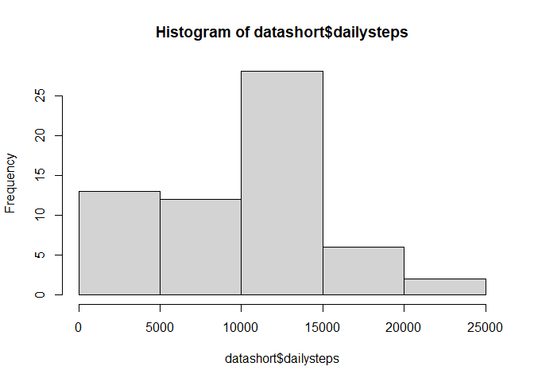
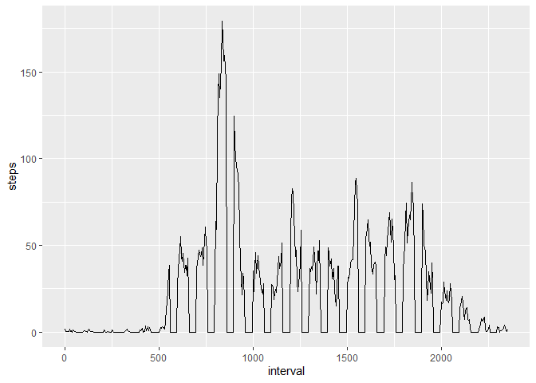
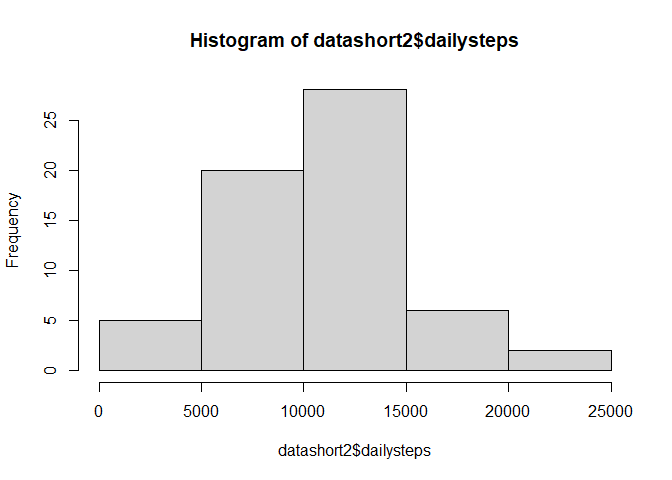
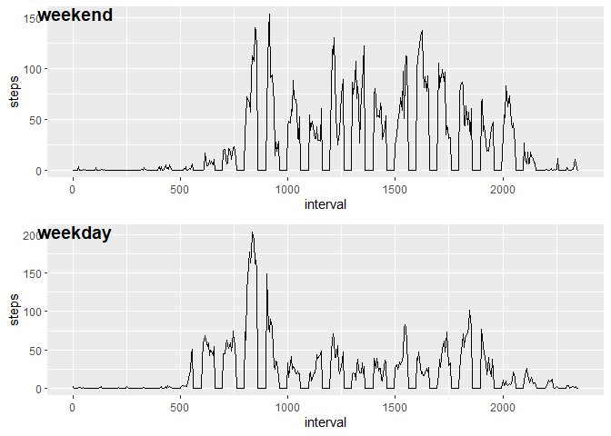

------------------------------------------------------------------------

Assignment 1  
author: Mathew Nickel Maunu

load needed libraries

\#1.Reading the dataset

\#2. plotting the steps per day

creating a sum of the steps per day

    dframe$daynum <- as.numeric(as.factor(dframe$date))
    dframe$dailysteps <- 0
    dframe$steps1 <- dframe$steps

\##removing NA values to make the data easier to work with

    for(i in 1:nrow(dframe))
    {
      if(is.na(dframe$steps[i]))
      {
        dframe$steps1[i] <- 0
      }
    }

\##calculating the steps per day

\##making the plot

    ## $breaks
    ## [1]     0  5000 10000 15000 20000 25000
    ## 
    ## $counts
    ## [1] 13 12 28  6  2
    ## 
    ## $density
    ## [1] 4.262295e-05 3.934426e-05 9.180328e-05 1.967213e-05 6.557377e-06
    ## 
    ## $mids
    ## [1]  2500  7500 12500 17500 22500
    ## 
    ## $xname
    ## [1] "datashort$dailysteps"
    ## 
    ## $equidist
    ## [1] TRUE
    ## 
    ## attr(,"class")
    ## [1] "histogram"

\#3.Mean and median of steps taken per day

\##mean

    ## [1] 9354.23

\##median

    ## [1] 10395

\#4.Timeseries plot of average number of steps taken

\##calculate the average steps per interval

\##plot the new data

\#5. Interval with the max steps

    ##   interval    steps
    ## 1      835 179.1311

\#6. Code to describe and show a strategy for inputting missing data

# In order to input missing data simply perform the following steps

# 1. read the new data into a data frame with a new name, we will use the name newdata (see part 1 of this script)

# 2a. if adding to the top: data &lt;- rbind(newdata, data) (and when adding to the bottom simply reverse the order in the brackets following the rbind command)

# 2b. if adding to the middle: data &lt;- add\_row(steps, date, interval, .before = desired row number)

# 3. rerun the script to get the data you need

# if trying to change a specific cell simply indicate the cell desired: data\[row, col\] &lt;- newdata

\#7. Missing values

# calculate rows with NA and fill with averages from \#4.

    ## [1] 2304

\#make a histogram of the total steps each day (filled) \#calculating
the steps per day (filled)

\#making the plot (filled)

\#Mean and median of steps taken per day (filled)

\#mean

    ## [1] 10580.84

\#median

    ## [1] 10395

\#Median steps remains the same, mean steps increases by approx 1000
steps. \##The number of days with steps in the 5000 - 10 000 bin
increases and these \#values are removed from the 0 - 5000 bin (approx
10% transfer).

\#8. Weekend walking

\#update the dataset with the new data

\#make datasets with the weekend/day average data

\#plot the steps/interval together

